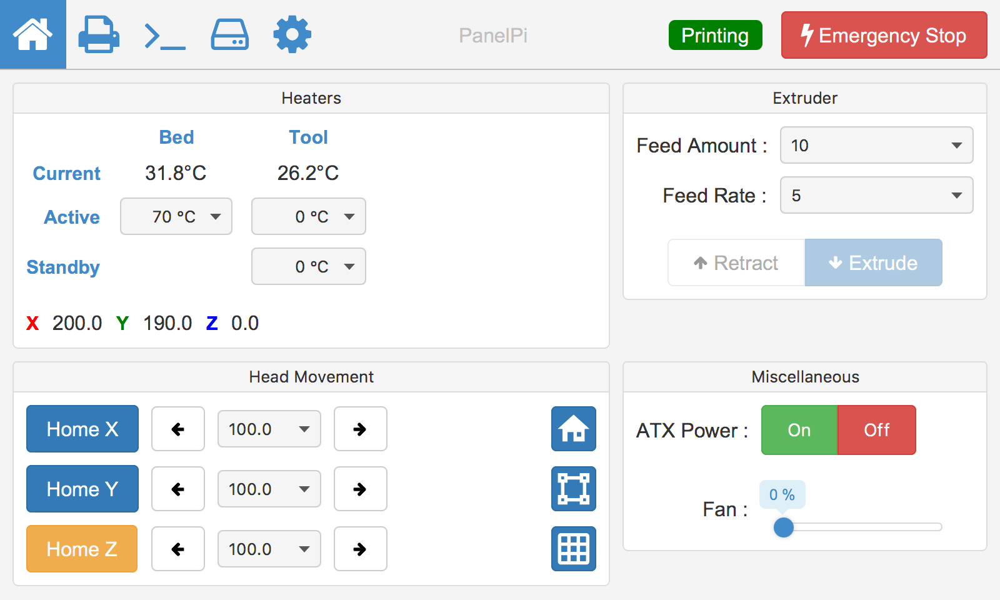
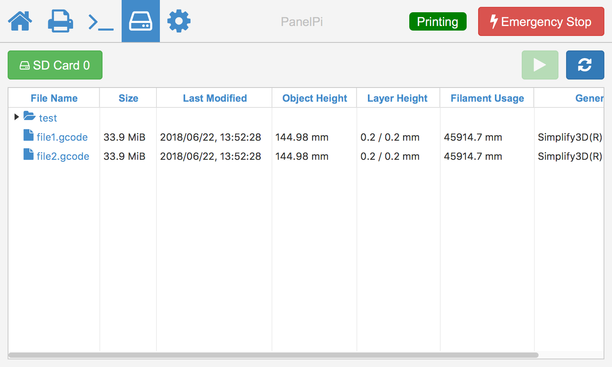

# PanelPi
**Raspberry Pi control panel for DuetWifi**

_Work In Progress_

## Releases
### Beta 1 
08/07/2018 - Beta 1 release!  
PanelPi is now in a usable state, however, only printer with XYZ axes and 1 hotend is supported, it was tested on a Core XY setup with a single hotend. 

## Why PanelPi?
The main motivation of starting this project is I want a control panel for my DuetWifi with a better UI and touchscreen then PanelDue.

### How is this better then PanelDue or duet web interface?
* Better UI :)
* Better touch experience with Raspberry Pi's capacitive touchscreen
* No wifi disconnect / javascript issues
### How is it worse?
* Long boot up time, RaspberryPi + JavaFX start up time can take from 30 seconds up to a minute.
* It consume more power

**PanelPi is _not_ a money saving solution to PanelDue, RaspberryPi + official 7" screen is not much cheaper**

## Screenshots
### Control View
<!-- .element height="50%" width="50%" -->
### Print Status View 
<!-- .element height="50%" width="50%" -->
### File View
<!-- .element height="50%" width="50%" -->

## Setting up Panel Pi
### Prerequisite
* Raspberry Pi 3
* Official Raspberry Pi 7" touchscreen

### Hardware setup

| DuetWifi | RaspberryPi |
|:--------:|:-----------:|
| +5v      |   5v        |
| Ground   |   Ground    |
| URXD0    |   GPIO14    |
| UTXD0    |   GPIO15    |

**The 5v output from the Panel Due port might be a little under voltage, which will trigger RaspPi's under voltage warning, it's better to get power directly from 5v PSU if possible.**

### Software setup
1. Flash RASPBIAN STRETCH Lite to your SD card 
   * https://www.raspberrypi.org/downloads/raspbian/

1. Setup raspberry pi wifi and ssh  
   * https://www.raspberrypi.org/forums/viewtopic.php?t=191252
   
1. SSH into RaspberryPi

1. raspi-conf
   * memory split - 128mb  
   * enable serial port
   * hostname
   * console auto login

1. apt-get update/upgrade  

1. install java  
   * `sudo apt-get install oracle-java8-jdk`

1. install javafx
   * https://lb.raspberrypi.org/forums/viewtopic.php?t=146098

1. install wiringpi
   * http://wiringpi.com/download-and-install/

1. install xorg
   * `sudo apt install xorg  libgtk2.0-0`

1. Run Panel Pi
   * `sudo java -Dprism.order=sw -Djava.ext.dirs=/home/pi/jdk1.8.0_92/jre/lib/ext/ -jar panelPi.jar`

## TODOs
* Console view
* Stop mimicking duet web interface and optimise UI for small touchscreen 
* Multi-hotend/Tool support
* More detailed step-by-step setup instructions
* Splash screen
* Use raspberry pi as a second SD card slot? (Is it possible?)
* improve startup time
* Edit list items in setting
* Developer docs
* Raspberry Pi image for easier setup
* UI for other screen resolutions?
* Port to android?
* Custom CSS

## Why JavaFX, Kotlin?
* Easy to mimic duet web interface's look and feel using CSS
* Possibility of porting to android
* Easy to write compact code quickly

## Known Issues
* Slider is difficult to use
 